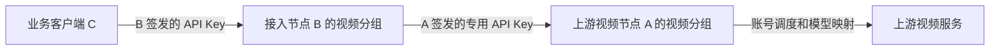

# 其他 Sub2API 对接视频分组二次开发指南

> 适用基线：`v0.1.168-fy.4` 及其后续兼容版本
> 文档日期：2026-07-30
> 面向对象：需要把一套 Sub2API 的视频能力接入另一套 Sub2API 的开发者和运维人员

## 1. 结论先行

Sub2API 的“分组”不是可通过远程内部编号调用的资源。跨实例对接时，真正的接入凭证是**绑定到视频分组的专用 Sub2API API Key**：上游节点根据该 Key 确定用户、分组、权限、模型范围和计费，接入节点不应持有上游 Admin Token，也不应在请求体中传递上游内部编号。

当前可按以下边界实施：

| 场景 | 是否需要二开 | 当前结论 |
| --- | --- | --- |
| 业务客户端直接调用上游视频节点 | 否 | 完整支持异步创建、查询、取消和成品下载 |
| 已带视频能力的 Sub2API 级联调用上游视频节点 | 否 | 仅同步生成可直接配置 |
| 原版或其他未带视频能力的 Sub2API | 是 | 需移植平台、账号、路由、计费和管理端能力 |
| Sub2API 到 Sub2API 的完整异步级联 | 是 | 需统一字符串任务号、状态响应、鉴权下载和跨机素材上传 |

不要把“账号连接测试成功”等同于“异步级联已兼容”。连接测试只验证 `/health`；现有真实上游异步协议与 Sub2API 公共异步协议并不完全相同。

## 2. 节点和调用关系

- **上游视频节点 A**：已经配置好视频分组和真实视频上游的 Sub2API。
- **接入节点 B**：准备向 A 采购视频能力的另一套 Sub2API。
- **业务客户端 C**：只持有 B 签发的 API Key，不接触 A 的内部账号和管理员凭据。



A、B 分别完成自己的鉴权、余额校验、限流和计费。B 不会继承 A 的售价或余额策略，运营方需要分别配置两端价格，并接受两端各自保留用量记录。

## 3. 上游视频节点 A 的准备

### 3.1 创建专用对接 Key

在 A 上为 B 创建独立用户或独立 API Key，并满足以下条件：

1. API Key 绑定到视频分组。
2. 分组已开启“允许当前分组生成视频”，并且该权限会在 API Key 鉴权时强制校验。
3. 分组、渠道和账号均为启用状态，所需模型有可调度账号和有效定价。
4. API Key 额度、并发、RPM 和 IP 白名单按 B 的出口地址单独设置。
5. 不复用管理员 Token、浏览器登录 Token 或真实上游服务密钥。

请求 JSON 不支持通过请求参数动态选组。A 始终以 Bearer Key 绑定的分组为准。

### 3.2 对外暴露的最小接口

A 至少需要提供：

```text
GET  /health
GET  /v1/models
POST /v1/videos/generations
```

如果需要完整异步能力，还需要：

```text
POST   /v1/videos/uploads
GET    /v1/videos/jobs
GET    /v1/videos/jobs/{job_id}
DELETE /v1/videos/jobs/{job_id}
GET    /v1/videos/jobs/{job_id}/content
```

除 `/health` 外，视频和模型接口均使用：

```http
Authorization: Bearer <A_ISSUED_SUB2API_KEY>
```

### 3.3 上游验收

先绕过 B，直接用 A 签发的 Key 完成一次调用。异步创建必须返回 HTTP `202`，其公共任务号为字符串：

```json
{
  "job_id": "vidjob_example",
  "status": "pending",
  "status_url": "/v1/videos/jobs/vidjob_example"
}
```

后续查询、取消和下载必须继续使用创建任务时的同一个 A Key。只验证 `/health` 不足以证明该 Key 已绑定正确视频分组。

## 4. 不改代码的同步级联方案

本节只适用于 B 已经包含本仓库的视频平台、账号和同步视频转发能力。若管理端无法选择视频平台，或 `/v1/videos/generations` 对视频分组返回 `404`，直接进入第 5 节做功能移植。

### 4.1 在 B 创建视频分组

1. 新建视频平台的分组。
2. 开启“允许当前分组生成视频”。
3. 配置视频倍率以及 480p、720p、1080p 的 USD/秒回退价格。
4. 按实际开放模型配置渠道视频定价；精确模型定价优先于分组回退价格。
5. 为业务客户端创建绑定到该分组的 B API Key。

### 4.2 在 B 创建指向 A 的视频上游账号

账号使用以下配置：

| 配置项 | 值 |
| --- | --- |
| 平台 | 视频平台 |
| 账号类型 | `API Key` |
| Base URL | `https://a.example.com/v1` |
| API Key | A 为 B 签发的专用 Sub2API Key |
| 代理和并发 | 按 B 到 A 的实际链路配置 |

Base URL 必须精确以 `/v1` 结束，不能填写站点根路径、`/openai/v1`、具体生成接口或带查询参数的地址。B 的连接测试会把 `/v1` 去掉后请求 A 的 `/health`。

对接另一套 Sub2API 时，模型映射应保持**公开模型名到公开模型名**，并以 A 的 `/v1/models` 返回结果为准。不要在 B 上提前改写公开模型名；真实上游模型别名只应在链路最后一跳配置一次。

### 4.3 同步调用

业务客户端用 B 签发的 Key 调用 B，并且**不要发送** `Prefer: respond-async`：

```bash
curl -X POST "https://b.example.com/v1/videos/generations" \
  -H "Authorization: Bearer $B_SUB2API_KEY" \
  -H "Content-Type: application/json" \
  -d '{
    "model": "seedance-2.0",
    "prompt": "A cinematic city at night",
    "resolution": "720p",
    "duration": 4,
    "aspect_ratio": "16:9",
    "audio": false
  }'
```

调用链为 C -> B -> A -> 上游视频服务。同步连接可能持续数分钟，因此 B 到 A、A 到上游视频服务以及各层反向代理的读取超时都必须覆盖最长生成时间。

### 4.4 同步方案的限制

- 发送 `Prefer: respond-async` 后，B 会进入本地异步任务链路，不能继续按同步方案运行。
- B 现有本地 `/v1/videos/uploads` 返回的素材地址面向 B 自己的上游服务部署；A 与 B 跨主机时通常无法读取。同步级联应先使用最终视频服务可访问的绝对 HTTP(S) 素材 URL。
- 同步响应中的视频通常仍来自真实上游 CDN，不经过 B 的本地成品存储。
- A、B 都会校验余额并记录用量。任一节点余额不足、分组未授权或无可用账号都会使整条调用失败。
- 不得形成 A -> B -> A 的账号配置环路，否则请求会递归转发直至超时或触发限流。

## 5. 其他 Sub2API 需要移植的能力

未包含视频能力的版本不能只增加一个平台下拉项。最小可用范围必须闭合以下业务链路：

| 能力边界 | 必须实现的内容 | 本仓库依据 |
| --- | --- | --- |
| 平台与分组 | 注册视频平台；把 API Key 分组带入路由；增加视频权限、倍率和分辨率价格 | `backend/internal/domain/constants.go`、`backend/ent/schema/group.go` |
| 上游账号 | API Key 账号、严格 `/v1` Base URL、模型映射、连接测试、账号调度 | 账号凭据与连接测试模块 |
| 同步网关 | Bearer 转发、模型改写、参数校验、失败切换、响应和错误脱敏 | 视频转发模块 |
| 路由鉴权 | `/v1/videos/*` 按 API Key 所属平台分派，非视频分组不得进入视频任务接口 | `backend/internal/server/routes/gateway.go` |
| 计费 | 按模型、分辨率、实际时长和视频倍率计费；写入视频用量元数据 | `billing_service.go`、`video_job_billing.go`、`model_pricing_resolver.go` |
| 异步任务 | 持久化任务、预占余额、轮询、结算、取消、重启恢复和成品保存 | `video_job_service.go`、`video_job_runtime.go`、`video_output_store.go` |
| 管理端与用户端 | 视频分组/上游账号配置、模型定价、视频工作台和 API 文档 | `frontend/src/views/admin/GroupsView.vue`、`frontend/src/views/user/VideoGenerationView.vue` |

数据库至少涉及以下迁移语义，不能只复制生成后的 Ent 文件：

- 分组生成权限；
- 视频倍率和三档回退价格；
- 视频用量字段与约束；
- 异步任务表；
- 权限字段变化后的鉴权缓存一致性。

不同 Sub2API 分支的表结构和迁移序号可能已经分叉。应按目标分支重新生成迁移并审查 SQL，不要直接复制迁移版本号后跳过冲突。

## 6. 完整异步级联的二开契约

### 6.1 为什么当前不能直接级联

现有 B 端异步客户端假定：

- 上游 `job_id` 是正整数；
- 异步任务表中的上游任务号是 `BIGINT`；
- 上游任务时间字段是整数；
- 完成结果包含可匿名下载的绝对视频 URL。

而 A 的 Sub2API 公共协议实际是：

- `job_id` 为 `vidjob_...` 字符串；
- `created_at`、`updated_at` 为 RFC 3339 字符串；
- `status_url` 和 `result.data[].mp4_url` 可以是相对路径；
- `/content` 必须携带创建任务时使用的 A Key。

因此仅把 A 地址和 Key 填入 B，会在创建响应解析或成品保存阶段失败。

### 6.2 推荐的最小改造

1. **统一上游任务号为字符串。** 把 DTO、领域模型、仓储接口、Ent Schema、数据库列、唯一索引、轮询和取消方法中的上游任务号从整数改为非空字符串。数字型上游任务号按十进制字符串保存，保持向后兼容。
2. **不解析无业务用途的上游时间字段。** B 只依赖 `job_id`、`status`、`result` 和 `error.message`；上游时间字段可从 DTO 删除并由 JSON 解码器忽略，避免整数/RFC 3339 类型冲突。
3. **固定上游任务路径。** 轮询和取消根据已校验的 A Base URL 与 URL 转义后的任务号构造 `/v1/videos/jobs/{job_id}`。不要直接请求响应中任意域名的 `status_url`。
4. **支持鉴权成品下载。** 当完成结果给出 A 的相对 `/content` 路径时，将其解析到 A 的固定 Origin，并使用该上游账号保存的 A Key 下载。Authorization 只能发送到 A 的已配置 Origin，跨域重定向必须去掉该请求头。
5. **保持对匿名 CDN 的兼容。** 如果真实上游服务返回绝对 CDN URL，继续按现有匿名下载流程处理，不能把 A Key 发给第三方 CDN。
6. **处理跨机素材。** MVP 可要求客户端只提交最终上游可访问的绝对 HTTP(S) URL。若要保留 B 的本地上传体验，应由 B 将 multipart 文件代理上传到 A 的 `/v1/videos/uploads`，再把 A 返回的 `media_url` 写入创建请求；不得把 B 的 loopback 素材地址直接交给 A。
7. **保留模糊失败保护。** 异步创建发生超时或连接中断时，B 不能确认 A 是否已经创建任务。在没有幂等键的前提下，不要自动换账号重复创建，避免产生多条收费任务。

该改造会触及数据库结构，实施前必须单独审批迁移、备份和回滚方案。本指南只定义兼容契约，不授权直接修改生产数据库。

### 6.3 对外协议保持不变

B 仍向 C 返回自己的任务号，不暴露 A 的任务号：

```json
{
  "job_id": "vidjob_b_node_job",
  "status": "pending",
  "status_url": "/v1/videos/jobs/vidjob_b_node_job"
}
```

B 在内部保存 `B 任务号 -> A 任务号 -> A 账号` 映射。查询、取消和下载都先用 B Key 校验任务归属，再由 B 使用固定的 A 账号凭据访问 A。A Key、A 任务号、真实上游账号和源站 URL 不得出现在 C 的响应或日志中。

## 7. 错误和重试约定

| 状态 | 含义 | B 的处理 |
| --- | --- | --- |
| `400`、`422` | 请求参数或模型组合错误 | 原样修正请求，不切换账号 |
| `401`、`403` | A Key 无效、IP 不允许或 A 分组未授权 | 停止重试，检查对接凭据和分组 |
| `402` | A Key 余额不足 | 停止创建，补充 A 侧余额 |
| `404` | 模型/任务不存在或任务不属于当前 A Key | 检查模型映射、任务与账号绑定 |
| `409` | 任务状态不允许取消或下载 | 先刷新任务状态 |
| `429` | A 侧 RPM、并发或限流 | 有界退避，不得无间隔重试 |
| `502`、`5xx` | 上游或网络暂时失败 | 只对明确未创建的请求有限重试 |

异步任务一旦拿到 A 的 `job_id`，后续操作必须固定使用创建该任务的 A 账号。不能在轮询阶段重新调度到另一个 A Key，因为 A 按创建 Key 隔离任务。

## 8. 验收清单

### 8.1 同步配置验收

- B 的视频上游账号连接测试通过，且 Base URL 精确为 A 的 `/v1`。
- B 使用公开模型名映射，未提前改写公开模型名。
- 不带 `Prefer` 的最小请求能够完成，并返回有效 MP4 URL。
- 无效模型返回 `400` 或 `404`，不会切到其他平台账号。
- A、B 都只新增一条预期用量，价格与各自配置一致。
- A Key 关闭、余额不足或分组权限关闭后，B 能收到可判断的错误而不是空成功响应。

### 8.2 异步二开验收

- 能接收并持久化 `vidjob_...` 上游任务号，服务重启后继续轮询。
- 能忽略 RFC 3339 上游时间字段，不影响状态解析。
- `pending -> running -> settling -> completed` 状态流转正确；失败和取消会释放 B 的预占余额。
- 查询、取消、下载始终使用创建任务时的同一个 A 账号。
- 相对 `/content` 地址会在服务端携带 A Key 下载，且 Key 不会随跨域重定向泄露。
- 匿名绝对 CDN URL 仍能下载，并且不会携带 A Key。
- 完成视频通过 B 的 `/content` 用 B Key 读取，其他 B Key 返回 `404`。
- 跨主机图片、视频和音频素材使用 A 可访问的 URL，或已实现 B -> A 上传代理。
- 创建请求超时的模糊失败不会自动重复创建收费任务。
- A、B 不存在互相指回的账号配置环路。

## 9. 回滚边界

- 仅使用同步级联时，回滚只需停用 B 的视频上游账号和分组，并撤销 A 为 B 签发的专用 Key，不需要改数据库。
- 已实施字符串上游任务号迁移时，不能在仍有活动字符串任务的情况下直接回退到 `BIGINT` 代码。应先停止新任务、等待或终止活动任务、备份视频任务表，再按已审批的迁移回滚。
- 撤销 A Key 前应先停用 B 的入口，否则 B 会持续产生 `401`/`403` 并触发无效告警。

## 10. 相关文档

- `docs/SEEDANCE_API_CLIENT_GUIDE_CN.md`：客户端异步调用示例和错误处理。
